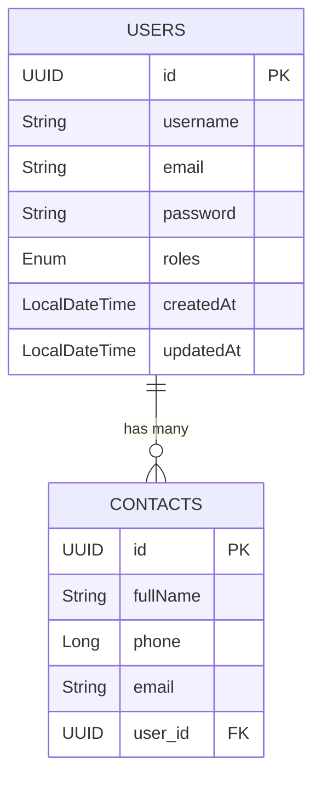

# REST API for Contacts

### Tecnologias
<section align="left">
    
    
    
    
     
     
     
    
    
    
    
    
    
    
    
</section>

#### 🔐 Auth

| Method | URL              | Description                |
| ------ | ---------------- | -------------------------- |
| POST   | `/api/auth/signup`  | Register a new user        |
| POST   | `/api/auth/signin`  | Login and obtain JWT token |
| POST   | `/api/auth/signout` | Logout (invalidate token)  |

#### 👤 User

| Method | URL             | Description                 |
| ------ | --------------- | --------------------------- |
| GET    | `/api/users/me` | Get authenticated user data |

#### 📇 Contacts (Authenticated Users Only)

| Method | URL                          | Description            |
| ------ | ---------------------------- | ---------------------- |
| GET    | `/api/users/me/contacts`            | List my contacts       |
| GET    | `/api/users/me/contacts/{contactId}`| Get a specific contact |
| POST   | `/api/users/me/contacts`            | Create a new contact   |
| PUT    | `/api/users/me/contacts/{contactId}`| Update a contact       |
| DELETE | `/api/users/me/contacts/{contactId}`| Delete a contact       |

#### Table Model

