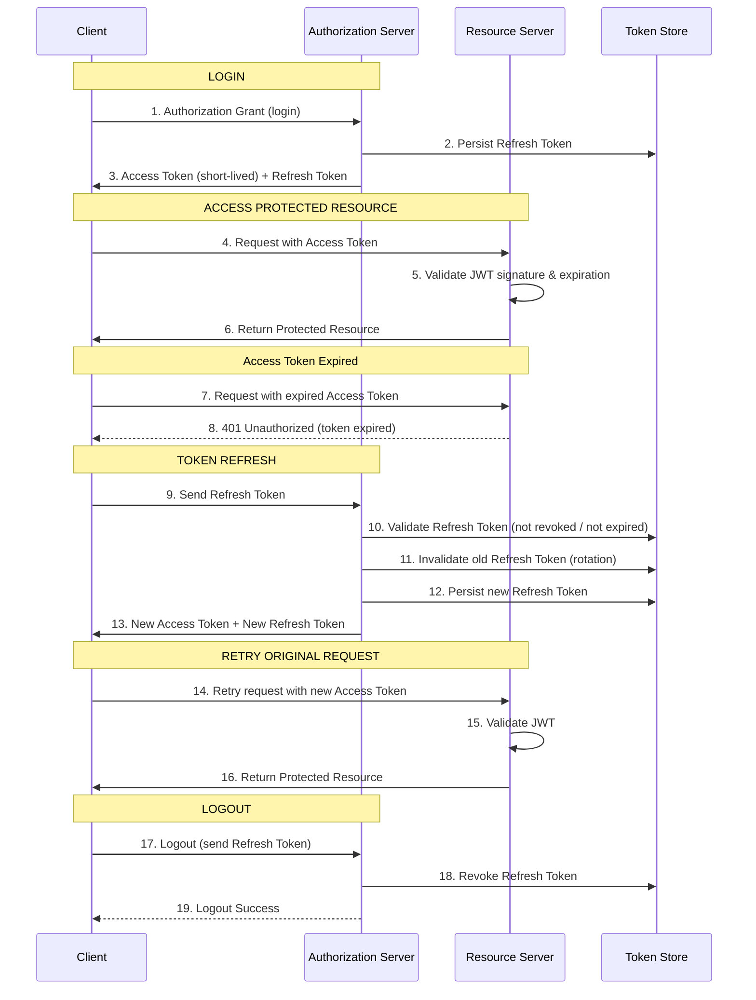

# Arquitetura do Access Token, Refresh Token e Logout (estudo de caso)

### Diagrama de Sequência

### Etapas do Diagrama

#### Login
...

#### Access Protected Resource
...

#### Access Token Expired
...

#### Token Refresh
...

#### Logout
...

### Anotações
#### Política de Sessões dos Usuários
Dependendo da política de sessão que será implementada, existem três caminhos possíveis nessa estratégia, sendo elas:
- 1. Permitir múltiplas sessões
- 2. Limitar quantidade de sessões por usuário
- 3. Single Session
